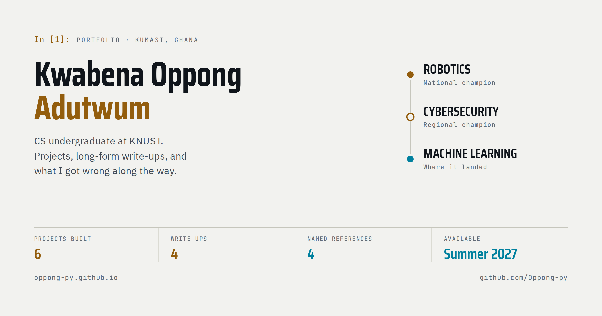

# oppong-py.github.io

My portfolio. Twelve pages of projects, write-ups and references.

**Live at [oppong-py.github.io](https://oppong-py.github.io)**



---

## What it is

I'm a Computer Science undergraduate at KNUST working toward machine learning engineering, and
this is where the work lives — robotics, embedded systems, and the ML I'm learning now.

The layout borrows the shape of a Jupyter notebook — numbered `In [n]:` prompts above each
section, one idea per cell, each section on its own short page rather than one long scroll.

An earlier version pushed that much further: the navigation itself read `df.projects`,
`nb.contents()`, `log.tail(n=5)`. A friend reviewing it told me the terms were getting in the
way of the content, and he was right. Now the code vocabulary is a garnish and every heading and
link is plain English. If a reader has to decode your navigation, the cleverness is costing you
more than it earns.

## Stack

**None.** Hand-written HTML, CSS and JavaScript. No framework, no bundler, no build step, no
`package.json`, no dependencies to install. Clone it and open `index.html`.

- 10 pages · ~160 KB of HTML total
- One stylesheet, 618 lines
- ~97 lines of JavaScript, inline, no libraries
- The only external requests are Google Fonts and the Formspree endpoint on the contact form

Fonts: Saira Condensed (display), JetBrains Mono (data and CLI), IBM Plex Sans (prose).

## Pages

| File | Nav label | What's on it |
|---|---|---|
| `index.html` | notebook | Hero, stats, contents, recent activity, three featured projects |
| `about.html` | about | Background, skills matrix, roles, education |
| `projects.html` | projects | Ten projects, newest first, six finished and four planned |
| `achievements.html` | awards | Competitions won, competitions entered, memberships |
| `certifications.html` | certificates | Four earned with the files attached, two in progress |
| `testimonials.html` | references | Four named referees and how each of them knows me |
| `writing.html` | writing | Four technical write-ups |
| `contact.html` | contact | Six channels and a form |
| `blog-*.html` | — | The four long-form posts |

## Details worth pointing at

**No theme flash.** The saved theme is read by an inline script in `<head>`, before the
stylesheet loads. Reading it after — or in a script at the end of the body — means the page
paints light and then snaps to dark, which is the most common way this gets done wrong.

**Light and dark are both designed, not inverted.** The full light palette is defined on bare
`:root`; dark redefines only the tokens, under both `prefers-color-scheme` and an explicit
`[data-theme]` stamp, so the OS setting and the manual toggle each win when they should.

**Contrast is measured, not assumed.** Every text node on every page in both themes was checked
against WCAG 2.1 with alpha composited through the full ancestor background stack — a naive
`rgba()` read gives false passes. 2,042 nodes, 0 failures. That audit is why `--accent-ink`
exists as a separate token from `--accent`: accent-coloured text on an accent-tinted background
cannot clear 4.5:1 no matter how light you make the background.

**Page transitions without a framework.** A short fade out, navigate, fade up — about 120ms of
actual delay. Internal links are prefetched on hover, so the next document is usually already
cached by the time you click. Everything respects `prefers-reduced-motion`, and the hidden start
state only applies once the script has run, so with JavaScript off the site is simply always
visible.

**Responsive without a framework either.** Card rows become scroll-snap rails below 768px, the
nav drops to its own scrolling row below 700px, and long project rows collapse to one column.

Every build is checked across 12 pages × 3 widths × 2 themes for horizontal overflow, console
errors and failed requests.

## Running it locally

```bash
git clone https://github.com/Oppong-py/oppong-py.github.io.git
cd oppong-py.github.io
python3 -m http.server 8000
```

Then open `http://localhost:8000`. Opening `index.html` directly works too.

## Layout

```
├── index.html            # and nine more pages, all at the root
├── styles.css            # the whole stylesheet
└── assets/
    ├── images/           # photography, project media, icons
    ├── docs/             # CV, résumé, certificates
    └── videos/
```

## Contact

[oppong-py.github.io/contact.html](https://oppong-py.github.io/contact.html) ·
[LinkedIn](https://www.linkedin.com/in/kwabena-oppong-adutwum) ·
oppongkwabena1777dev@gmail.com
